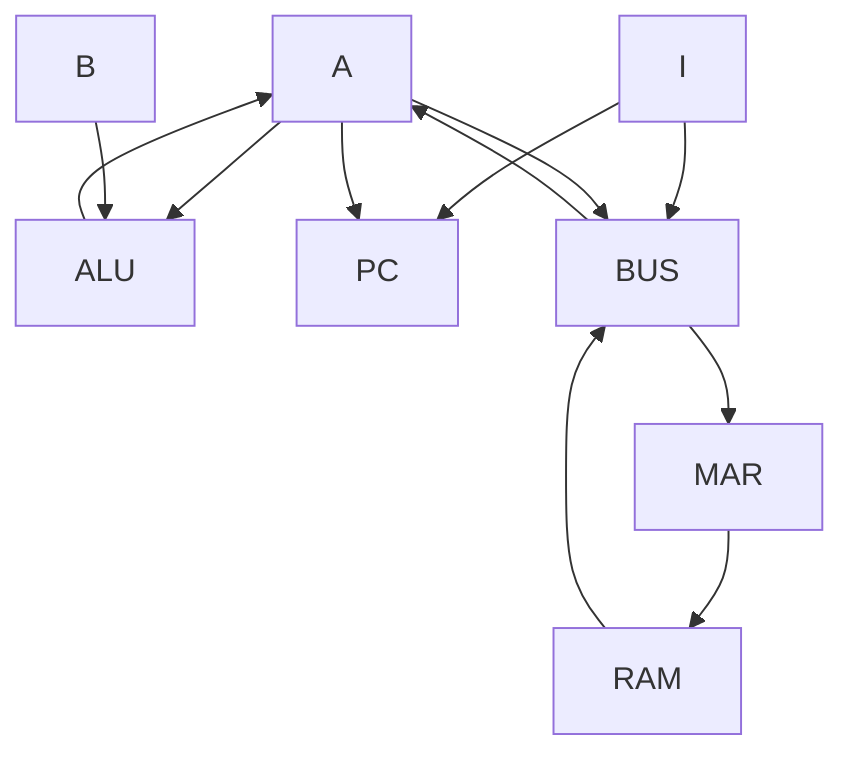

# IGGLE-4

IGGLE-4 is a CPU which strives to use as few parts as possible while still being a versatile and easy to use CPU. It is 4 bit Harvard Architecture, with an 8 bit program counters and 8 bit instructions with 4 bit opcodes and operands.

